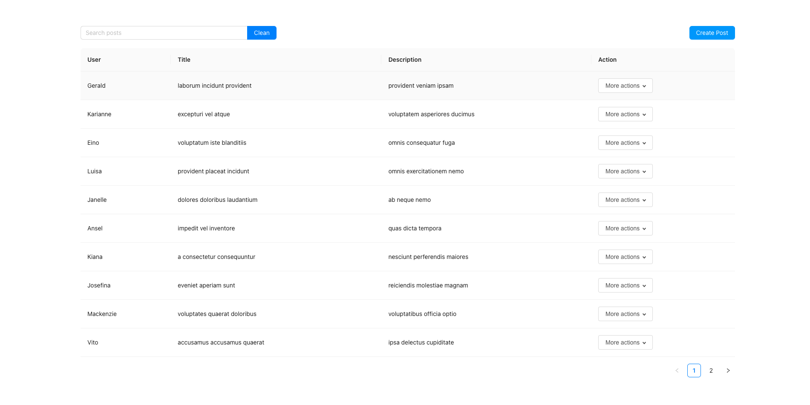
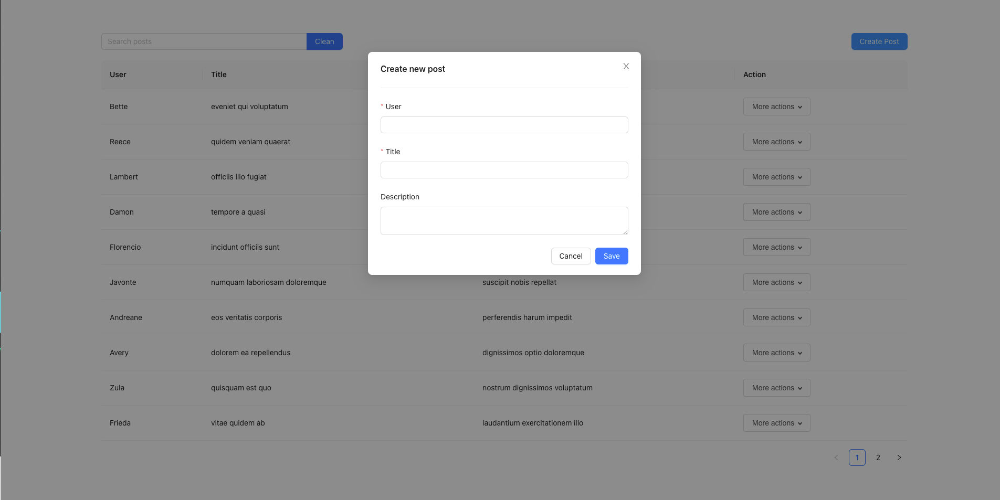
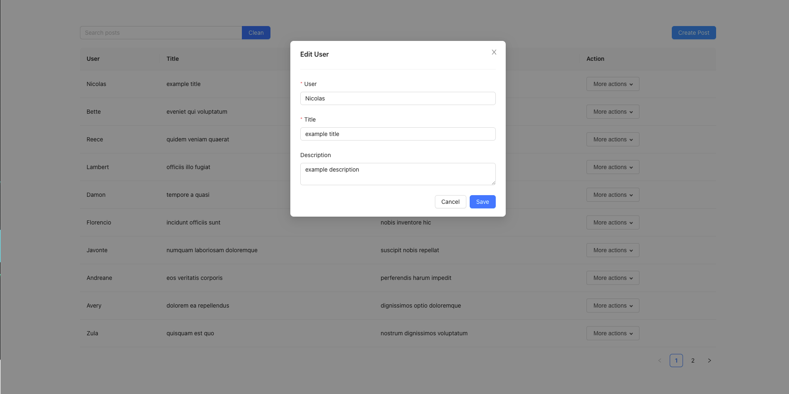
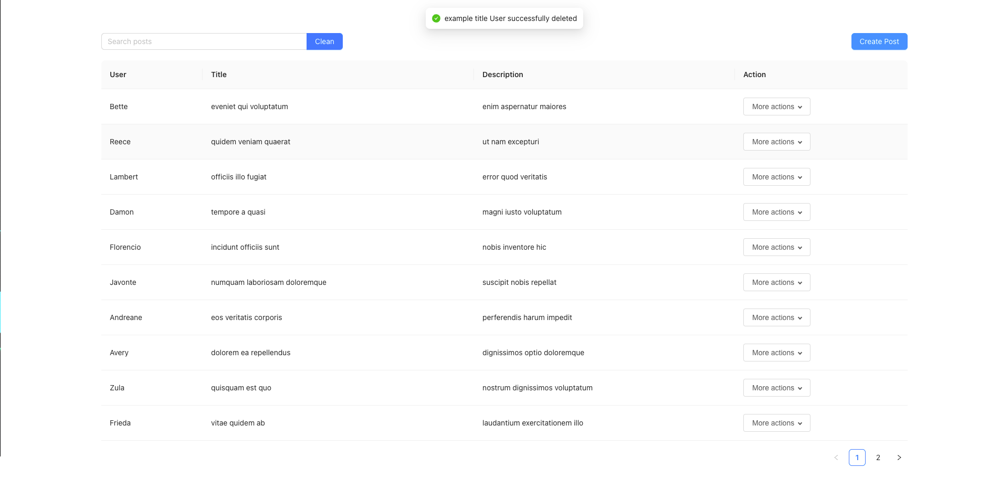
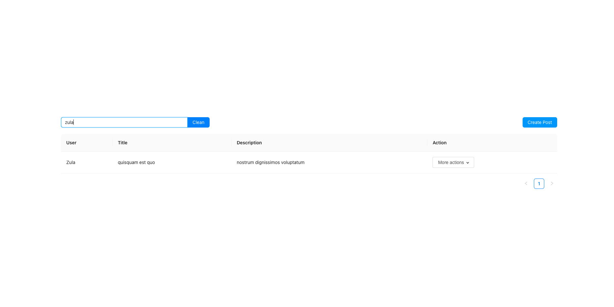
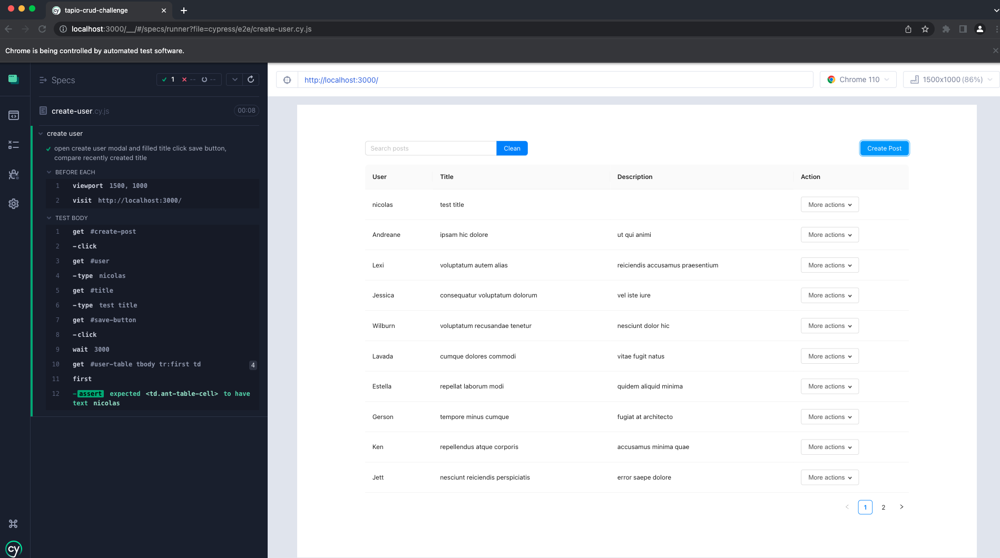

# Tapio Post CRUD Challenge

## Available Scripts

Install dependencies 

### `npm install`

In the project directory, you can run:

### `npm run start`

Runs the app in the development mode.\
Open [http://localhost:3000](http://localhost:3000) to view it in the browser.

### `npm run cy:open`
Run the test 
Be Carefull! You need to run the server first

 
Here the post page where you can search for posts, add posts, edit posts.

Here the cypress test cases check if the user successfully created 

