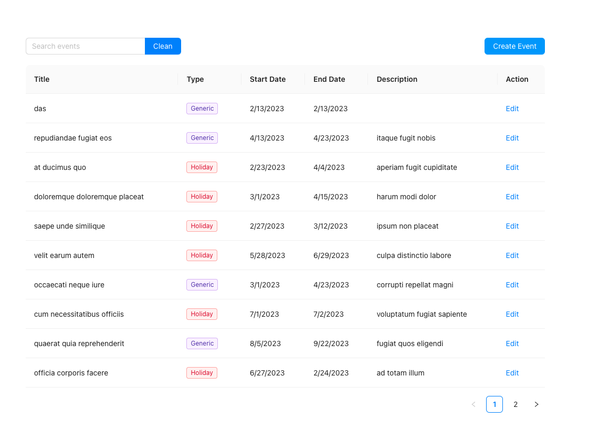
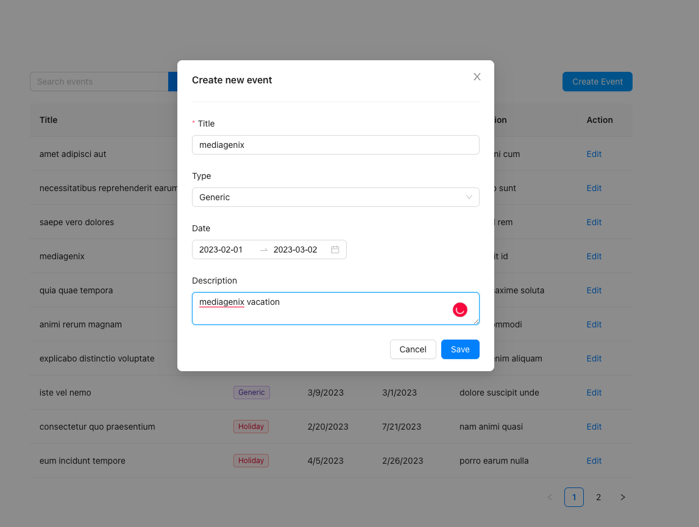
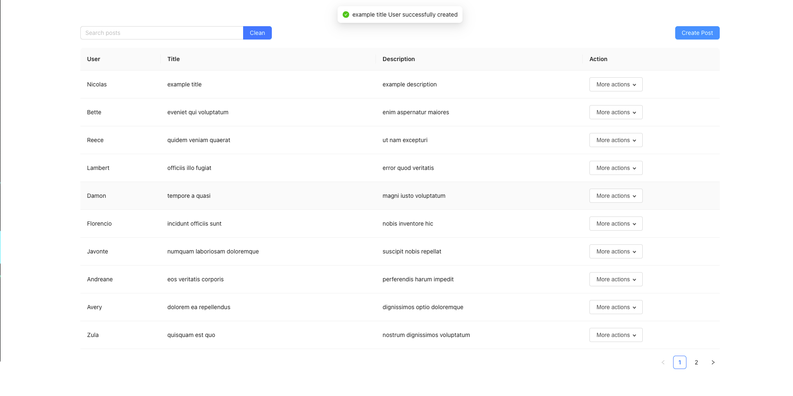
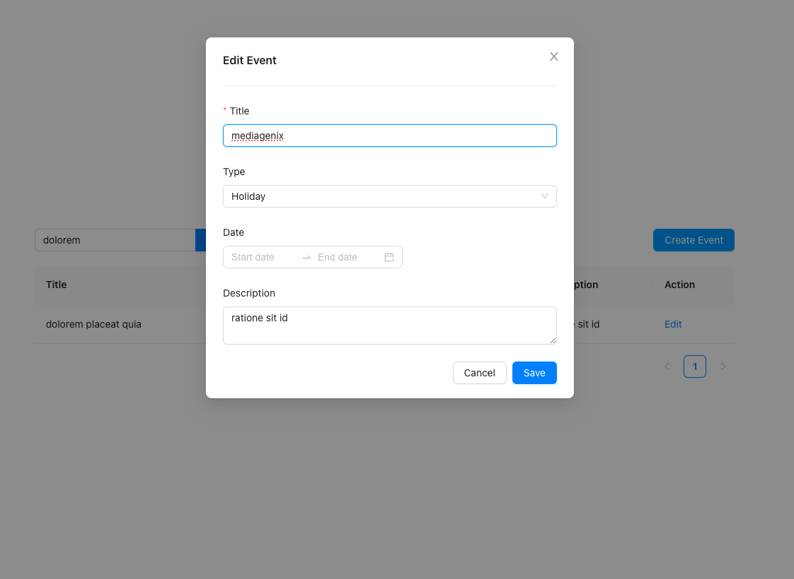
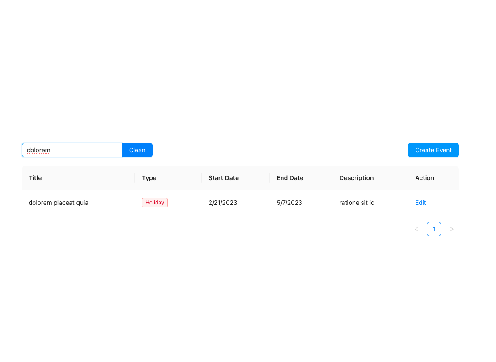

# Tapio User CRUD Challenge

## Available Scripts

Install dependencies 

### `npm install`

In the project directory, you can run:

### `npm run start`

Runs the app in the development mode.\
Open [http://localhost:3000](http://localhost:3000) to view it in the browser.

Here the user page where you can search for users, add users, edit users.

